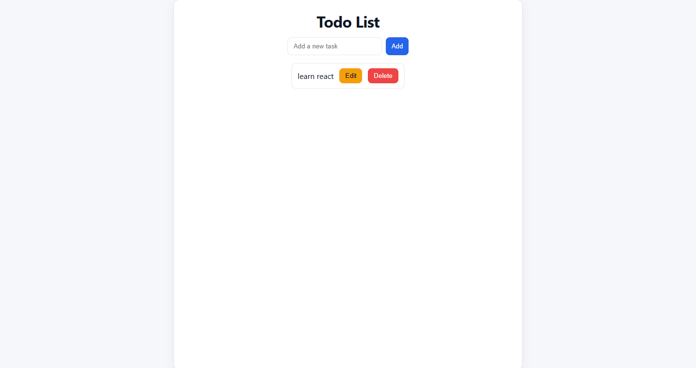
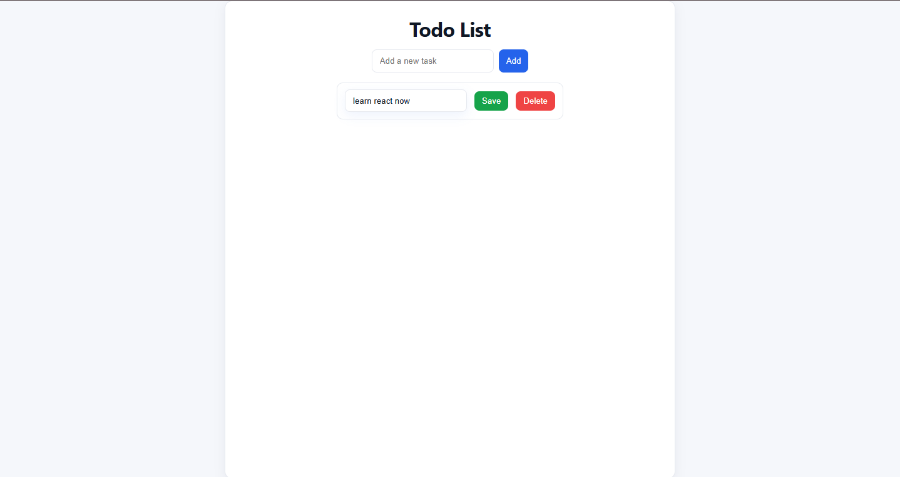

# React TypeScript Todo List App

This is a simple Todo List application built with React and TypeScript. It allows users to add, edit, and delete tasks.

## Features

*   Add new tasks
*   Mark tasks as complete
*   Edit existing tasks
*   Delete tasks

## Getting Started

To get a local copy up and running, follow these simple steps.

### Prerequisites

*   Node.js and npm installed on your machine.

### Installation

1.  Clone the repo
    ```sh
    git clone https://github.com/Macmilan24/a2sv-task4.git
    ```
2.  Install NPM packages
    ```sh
    npm install
    ```
3.  Run the application
    ```sh
    npm start
    ```

The application will be available at `http://localhost:3000`.

<figure align="center">
    
    <figcaption>Todo List page</figcaption>
  
</figure>

<figure align="center">
    
    <figcaption>Add functionality</figcaption>
  
</figure>

<figure align="center">
    
    <figcaption>Edit functionality</figcaption>
  
</figure>